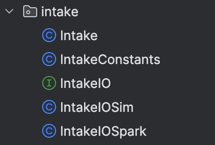
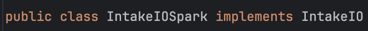
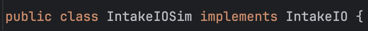

# Project Structure

An FRC project is set up differently than a normal Java project.

We have a folder for each subsystem.

This is an example of the different files in our intake subsystem

First, we have IntakeIO. This is an interface. We need an interface so we can switch between our simulation and real world code.

IntakeIOSpark and IntakeIOSim both implement IntakeIO's interface.

IntakeIOSpark is the link between hardware and software. We define motor related things here (like encoders) and create methods to track a motor's position, temperature, and voltage. 
